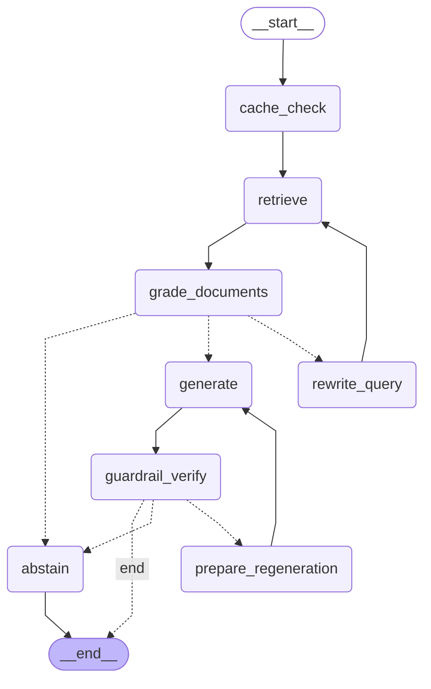

# Corrective RAG graph

The compiled graph has a default LangGraph recursion limit of 15. Retry and
regeneration decisions use `settings.max_rewrites` and
`settings.max_regenerations`.

```mermaid
---
config:
  flowchart:
    curve: linear
---
graph TD;
	__start__([<p>__start__</p>]):::first
	cache_check(cache_check)
	retrieve(retrieve)
	grade_documents(grade_documents)
	rewrite_query(rewrite_query)
	generate(generate)
	guardrail_verify(guardrail_verify)
	prepare_regeneration(prepare_regeneration)
	abstain(abstain)
	__end__([<p>__end__</p>]):::last
	__start__ --> cache_check;
	cache_check --> retrieve;
	generate --> guardrail_verify;
	grade_documents -.-> abstain;
	grade_documents -.-> generate;
	grade_documents -.-> rewrite_query;
	guardrail_verify -. &nbsp;end&nbsp; .-> __end__;
	guardrail_verify -.-> abstain;
	guardrail_verify -.-> prepare_regeneration;
	prepare_regeneration --> generate;
	retrieve --> grade_documents;
	rewrite_query --> retrieve;
	abstain --> __end__;
	classDef default fill:#f2f0ff,line-height:1.2
	classDef first fill-opacity:0
	classDef last fill:#bfb6fc

```
